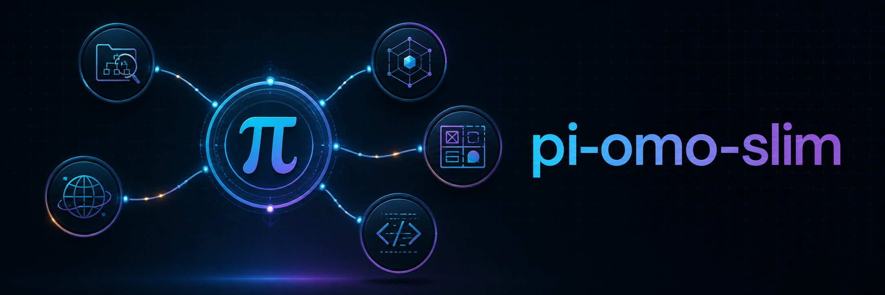

# pi-omo-slim



An unofficial, lightweight OMO-slim-style orchestration setup for [Pi](https://github.com/earendil-works/pi).

`pi-omo-slim` gives Pi a workflow-oriented Orchestrator and five focused specialist agents:

- **Explorer** — local codebase reconnaissance;
- **Librarian** — external documentation and library research;
- **Oracle** — architecture, debugging strategy, review, and simplification;
- **Designer** — UI/UX design, review, and implementation;
- **Fixer** — bounded, non-visual implementation.

This project is a configuration bundle. It does not fork Pi, `pi-subagents`, or OMO-slim. It adapts OMO-slim's role boundaries and orchestration approach to the extension and subagent APIs that Pi actually provides.

## Requirements

- Pi; currently tested with **0.83.0**;
- the following Pi packages:
  - `@tintinweb/pi-subagents`
  - `@ff-labs/pi-fff`
  - `pi-web-access`
  - `pi-lens`
  - `@firstpick/pi-extension-safety-guard`

The Agent templates in this repository do not pin a provider, model, or thinking level. By default, they inherit those settings from the parent Agent. During installation, you can choose to inherit everything, apply one shared configuration to all five roles, or configure each role separately. Any pinned model must be selected from the models available in your current Pi environment. The installing Agent modifies only the copies written to your Pi configuration directory, never the source templates in this repository.

## Recommended installation

Open Pi in any directory and enter the following prompt. You do not need to clone the repository yourself:

```text
Install pi-omo-slim from https://github.com/joshua-zyy/pi-omo-slim. First ask me where the repository should be cloned. Before cloning, show me the exact target path and git clone command and wait for my explicit approval. Do not overwrite or update an existing directory without inspecting it and obtaining separate approval. After cloning, read INSTALL_AGENT.md from the local clone completely and follow it exactly. Approval to clone is not approval to modify my Pi configuration. Do not modify my Pi configuration until you have shown me the exact targets, backup plan, and commands required by INSTALL_AGENT.md and I have approved the final installation proposal.
```

The Agent will ask where to place the repository, obtain approval for the exact clone command, and then continue from the local installation guide. That guide separately instructs the Agent to inspect the Pi environment, ask how models should be configured, resolve same-name Agent conflicts individually, let the user choose strict or compatibility routing, back up affected configuration, install missing dependencies, copy the approved project files, and verify the result.

Repository cloning and Pi configuration installation are two separate approval checkpoints. Approving the clone does not authorize any Pi configuration change.

## Manual installation outline

If you prefer to configure Pi yourself:

1. Install the five required packages with `pi install npm:<package-name>`.
2. Copy `agents/*.md` to Pi's global `agents` directory.
   Leave `model` and `thinking` omitted to inherit from the parent Agent. If you want pinned settings, modify only the destination copies.
3. Copy `extensions/orchestrator-mode` to Pi's global `extensions` directory.
4. Optionally create `<config-root>/orchestrator-mode.json` from `config/orchestrator-mode.json.example`. Set `defaultEnabled` to `true` to enable Orchestrator Mode by default in sessions that have no explicit mode state.
5. Merge the two properties from `config/subagents.json` into `<config-root>/subagents.json` without overwriting unrelated settings.
6. Restart Pi so that `pi-subagents` rebuilds its Agent type list.
7. Run `/orchestrator status`; use `/orchestrator on` or `/orchestrator off` to override the mode for the current session branch.

The default global configuration directory is `~/.pi/agent`. If `PI_CODING_AGENT_DIR` is set, Pi uses the directory specified by that environment variable instead.

Always back up existing files before copying or merging. In particular, never silently overwrite custom Agents with the same names.

## Commands

```text
/orchestrator          Toggle the mode
/orchestrator on       Enable it for the current session branch
/orchestrator off      Disable it
/orchestrator status   Show its current state
```

The optional global configuration file is `<config-root>/orchestrator-mode.json`:

```json
{
  "defaultEnabled": true
}
```

`defaultEnabled` affects only this Orchestrator Mode extension; it does not enable or disable any other Pi extension. When the file or property is absent, the global default is `false`. Invalid JSON or a non-boolean value produces a warning and also falls back to `false`. After editing the file, run `/reload` or restart Pi so the extension reloads the configuration.

The effective state priority is: the latest explicit state in the current session branch, then `defaultEnabled`, then `false`. Consequently, `defaultEnabled: true` enables the mode when Pi opens a new session or switches to a session with no recorded mode state. A session branch that previously ran `/orchestrator on` or `/orchestrator off` retains that explicit state.

## Differences from OMO-slim on OpenCode

This project is an adaptation and does not claim complete runtime parity. Pi's `Agent`, `get_subagent_result`, `steer_subagent`, and `resume` mechanisms cover the main workflow, but they do not reproduce every OMO-slim/OpenCode facility exactly. In particular, this project does not claim to provide OMO-slim's Background Job Board, Wake Scheduler, or identical task-cancellation behavior.

Designer and Fixer can write files and run shell commands. The Safety Guard extension is an additional lifecycle defense, not an operating-system sandbox or a substitute for user approval and project-specific instructions.

## Project layout

```text
agents/                         Five pi-subagents Agent definitions
config/                         Installation configuration templates
extensions/orchestrator-mode/  Mode commands, state handling, and policy
scripts/                        Deterministic installation backup utility
INSTALL_AGENT.md                Installation procedure for a Pi Agent
```

## Attribution and third-party notices

The specialist Agent prompts and Orchestrator policy in this repository are adapted from:

- Project: [oh-my-opencode-slim](https://github.com/alvinunreal/oh-my-opencode-slim)
- Adaptation baseline: 2.2.13, commit `282d5f26a4ad2665118a73014fcf02e57869bd38`
- License: MIT

The upstream copyright notice and MIT terms are retained in [LICENSE](LICENSE).

This project asks users to install, but does not vendor, the following independently maintained Pi packages. When this project was prepared, the tested versions below each declared the MIT License:

| Package | Tested version | Upstream repository |
| --- | ---: | --- |
| `@tintinweb/pi-subagents` | 0.15.0 | <https://github.com/tintinweb/pi-subagents> |
| `@ff-labs/pi-fff` | 0.10.3 | <https://github.com/dmtrKovalenko/fff> |
| `pi-web-access` | 0.21.0 | <https://github.com/nicobailon/pi-web-access> |
| `pi-lens` | 3.8.74 | <https://github.com/apmantza/pi-lens> |
| `@firstpick/pi-extension-safety-guard` | 0.2.7 | <https://github.com/Firstp1ck/pi-coding-agent-forge> |

These dependencies remain subject to their respective upstream licenses. The authoritative license and notices are those included with the versions users actually install.

`pi-omo-slim` is an independent community adaptation. It is not affiliated with or endorsed by OMO-slim, OpenCode, Pi, or the maintainers of the packages listed above.

## License

MIT. See [LICENSE](LICENSE).
