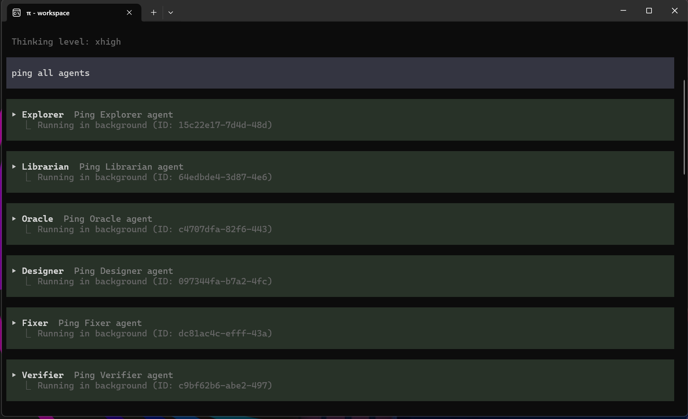
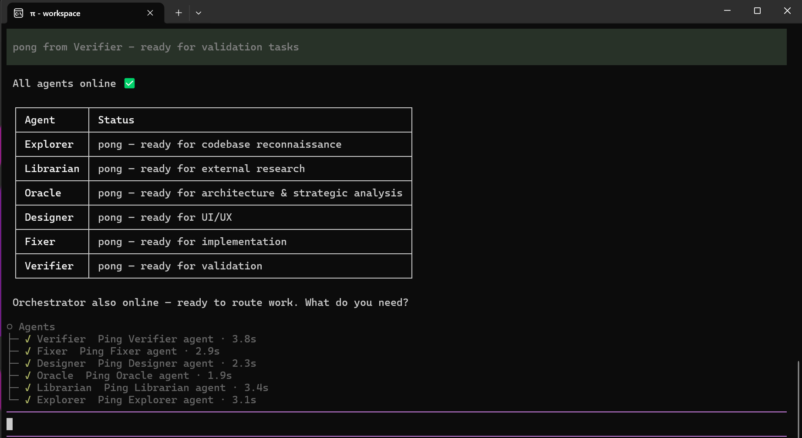

# pi-omo-slim

[English](README.md) · [简体中文](README.zh-CN.md)


针对 [Pi](https://github.com/earendil-works/pi) 的轻量级 OMO-slim 风格编排配置。

本仓库中的 Orchestrator 与专家 Agent 提示词是持续演进的文档：会随日常使用中发现的问题不断优化与更新，因此新安装副本的行为可能领先于旧副本。如需获取提示词更新，请重新执行安装器的 `plan`/`apply` 流程。

`pi-omo-slim` 为 Pi 提供一个面向工作流的 Orchestrator（编排器）与六个专注的专家 Agent：

- **Explorer** — 本地代码库侦察；
- **Librarian** — 外部文档与库研究；
- **Oracle** — 架构、调试策略、评审与简化；
- **Designer** — UI/UX 设计、评审与实现；
- **Fixer** — 有界的非视觉实现；
- **Verifier** — 对已完成 Fixer 工作的独立评审与有界验证。

本项目是一个配置包。它不 fork Pi、`pi-subagents` 或 OMO-slim，而是把 OMO-slim 的角色边界与编排方法适配到 Pi 实际提供的扩展与子 Agent API 之上。

## 环境要求

- Pi；要求 **>= 0.80.6**，因为 `@narumitw/pi-goal` 依赖 Pi 的 `agent_settled` 生命周期；安装器会在 `plan` 阶段强制此下限，更低的 Pi 会被 fail-closed 拒绝。本次发布以 **0.84.2** 完成集成验收（仓库的 `@earendil-works/pi-coding-agent` dev dependency 不因此修改）；
- 以下 Pi 包：
  - `@tintinweb/pi-subagents` — **>= 0.15.0**：strict 路由的 `fallbackSubagent: "none"` 从该版本起才存在，安装器会在 `plan` 阶段强制此下限
  - `@ff-labs/pi-fff`
  - `pi-web-access`
  - `pi-lens`
  - `@firstpick/pi-extension-safety-guard`
  - `@narumitw/pi-chrome-devtools`
  - `@narumitw/pi-goal`
  - `@juicesharp/rpiv-todo`

本仓库中的 Agent 模板不固定 provider、模型或思考级别。默认情况下，它们继承父 Agent 的这些设置。安装期间，你可以选择全部继承、为六个角色统一应用一份共享配置，或为每个角色单独配置。任何固定的模型都必须选自你当前 Pi 环境中可用的模型。安装 Agent 只修改写入你 Pi 配置目录的副本，绝不修改本仓库中的源模板。

## 推荐安装方式

在任意目录中打开 Pi，输入以下提示词。你无需自行克隆仓库：

```text
从 https://github.com/joshua-zyy/pi-omo-slim 安装 pi-omo-slim。首先询问我仓库应该克隆到哪里。在克隆之前，向我展示确切的目标路径和 git clone 命令，并等待我的明确批准。未经检查并获得单独批准，不得覆盖或更新已有目录。克隆完成后，完整阅读本地克隆中的 INSTALL_AGENT.md 并严格遵循其步骤。批准克隆并不等于批准修改我的 Pi 配置。在向我展示 INSTALL_AGENT.md 要求的准确目标、备份方案和命令，并且我批准最终安装方案之前，不得修改我的 Pi 配置。
```

Agent 会询问仓库的存放位置，在获得确切克隆命令的批准后，再从本地安装指南继续。该指南以 `scripts/install.mjs` 作为唯一确定性入口：Agent 编写一份封闭式请求，生成不可变计划，展示其操作、自动回滚范围与 SHA-256 供你明确批准，然后执行一次 `apply` 命令。备份、写入、验证与失败回滚均由固定的跨平台 Node.js 安装器实现，而不是由 Agent 自写的 shell 命令完成。

仓库克隆与 Pi 配置安装是两个相互独立的批准检查点。批准克隆并不授权任何 Pi 配置变更。

## 确定性安装概要

先分别安装上述八个必需包，再制定计划；`plan` 会强制 Pi >= 0.80.6 与 `@tintinweb/pi-subagents` >= 0.15.0 的下限。随后创建 `INSTALL_AGENT.md` 中记载的封闭式 `request.json`，并运行：

```text
node scripts/install.mjs plan --request <absolute-request.json> --config-root <absolute-config-root>
node scripts/install.mjs apply --plan <absolute-plan.json> --sha256 <approved-plan-sha256>
```

审查生成的计划，并在 `apply` 之前批准其确切 SHA。安装器会备份最新的执行时状态，只写入已批准的目标，执行固定验证，并在失败时自动回滚由事务创建或替换的文件。计划、备份、结果与回滚报告均保留在 Pi 配置根目录下，便于审计。

默认的全局配置目录为 `~/.pi/agent`。若设置了 `PI_CODING_AGENT_DIR`，Pi 将使用该环境变量指定的目录。

不要手工编辑生成的计划，也不要静默覆盖同名自定义 Agent。当选项或已批准的替换冲突发生变化时，请重新生成新计划。

安装完成后，用 `/orchestrator on` 启用 Orchestrator Mode，然后发送 `ping all agents` 做一次冒烟测试。六个专家 Agent 会被并行派发：



随后它们逐一回应，确认六个角色齐备，且 Orchestrator 已就绪可以开始路由工作：



## 命令

```text
/orchestrator          切换模式
/orchestrator on       为当前会话分支启用
/orchestrator off      禁用
/orchestrator status   显示当前状态
```

可选的全局配置文件为 `<config-root>/orchestrator-mode.json`：

```json
{
  "defaultEnabled": true
}
```

`defaultEnabled` 仅影响本 Orchestrator Mode 扩展，不会启用或禁用任何其他 Pi 扩展。当该文件或属性不存在时，全局默认值为 `false`。无效的 JSON 或非布尔值会产生警告，并同样回退为 `false`。扩展会在加载时读取一次 `extensions/orchestrator-mode/orchestrator-policy.md` 和 `extensions/orchestrator-mode/orchestrator-goal-policy.md`；仅当当前会话分支存在活跃的原生 Goal 时，才注入 Goal addendum。编辑这些文件后，运行 `/reload` 或重启 Pi，让扩展重新加载它们。

生效状态的优先级为：当前会话分支中最近一次显式状态，其次 `defaultEnabled`，最后 `false`。因此，当 Pi 打开新会话或切换到未记录模式状态的会话时，`defaultEnabled: true` 会启用该模式；而曾执行过 `/orchestrator on` 或 `/orchestrator off` 的会话分支则保留其显式状态。

## Goal 集成

`@juicesharp/rpiv-todo` 是固定依赖，安装后所有模式都会获得其原生 `todo` 工具、`/todos` UI 与默认 guidance。

Goal 始终由用户显式启动。你必须显式运行 `pi-goal` 原生命令，例如：

```text
/goal <objective>
/goal --tokens 100k <objective>
```

Orchestrator 永远不会自动启动 Goal；本项目不提供 UltraGoal，也没有自动 Goal 转换。

- 默认模式下，`/goal` 只遵循 `pi-goal` 原生工作流，不应用 Orchestrator 的 Wave 纪律。
- Orchestrator Mode 下，`/goal` 保持 `pi-goal` 原生语义，并额外倾向把可独立进行的工作拆成并行的后台专家 lane，同时提供单一当前 Wave 检查点、后台 subagent 等待协调与既有风险路由。

`rpiv-todo` 只维护当前 Wave/阶段检查点，不实时跟踪每个 subagent 的状态；subagent 实时状态仍以 Pi 的 Agent 工具为准。Orchestrator policy 是提示词层面的行为约束，不是替代 `pi-goal` 或 `rpiv-todo` 运行时校验的强制状态机。

`pi-goal` 的原生 token budget 只统计主会话分支中的 assistant 用量，不包含 Orchestrator 派出的独立 subagent 会话。本项目不聚合这些用量，`/goal --tokens` 也不是涵盖 specialist 消耗的总上限。lane 数量或 `max_turns` 不是 token 预算的替代品。

`@juicesharp/rpiv-i18n` 是 `rpiv-todo` 的 optional peer；未安装时 UI 回退为英文，todo 功能不受影响。本项目从不写入 `rpiv-todo` guidance 配置；上游默认行为与自行配置权保留给用户。

## 与 OpenCode 上 OMO-slim 的差异

本项目是适配版本，不声称具有完全的运行时对等性。Pi 的 `Agent`、`get_subagent_result` 与 `steer_subagent` 机制覆盖了主要工作流，但并未逐项复刻 OMO-slim/OpenCode 的每一项设施。尽管 `pi-subagents` 也提供 `resume`，本项目仍将已完成的专家会话视为终结性会话，不依赖会话复用。具体而言，本项目不声称提供 OMO-slim 的后台任务板（Background Job Board）、唤醒调度器（Wake Scheduler）或完全一致的任务取消行为。

Designer 与 Fixer 可以写文件并运行 shell 命令。Oracle 与 Verifier 没有写文件工具，但可以运行有界的 shell 诊断或验证。Safety Guard 扩展是额外的生命周期防御，而非操作系统级沙箱，也不能替代用户批准与项目专属指令。

## 项目结构

```text
agents/                         六个 pi-subagents Agent 定义
config/                         安装配置模板
extensions/orchestrator-mode/   模式命令、状态处理与策略
scripts/install.mjs             确定性的 plan/apply/verify/rollback 安装器
INSTALL_AGENT.md                Pi Agent 的安装流程
```

## 致谢与第三方声明

本仓库中的专家 Agent 提示词与 Orchestrator 策略改编自：

- 项目：[oh-my-opencode-slim](https://github.com/alvinunreal/oh-my-opencode-slim)
- 改编基线：2.2.13，commit `282d5f26a4ad2665118a73014fcf02e57869bd38`
- 许可证：MIT

上游版权声明与 MIT 条款保留在 [LICENSE](LICENSE) 中。

本项目要求用户自行安装（但不打包）以下独立维护的 Pi 包。项目准备期间，下列各测试版本均声明采用 MIT 许可证：

| Package | Tested version | Upstream repository |
| --- | ---: | --- |
| `@tintinweb/pi-subagents` | 0.15.0 | <https://github.com/tintinweb/pi-subagents> |
| `@ff-labs/pi-fff` | 0.10.3 | <https://github.com/dmtrKovalenko/fff> |
| `pi-web-access` | 0.21.0 | <https://github.com/nicobailon/pi-web-access> |
| `pi-lens` | 3.8.74 | <https://github.com/apmantza/pi-lens> |
| `@firstpick/pi-extension-safety-guard` | 0.2.7 | <https://github.com/Firstp1ck/pi-coding-agent-forge> |
| `@narumitw/pi-chrome-devtools` | 0.52.0 | <https://github.com/narumiruna/pi-extensions/tree/main/packages/pi-chrome-devtools> |
| `@narumitw/pi-goal` | 0.51.0 | <https://github.com/narumiruna/pi-extensions> |
| `@juicesharp/rpiv-todo` | 2.6.0 | <https://github.com/juicesharp/rpiv-mono> |

这些依赖仍受各自上游许可证的约束。权威的许可证与声明以用户实际安装的版本所附带的为准。

`pi-omo-slim` 是一个独立的社区改编项目，与 OMO-slim、OpenCode、Pi 以及上列各包的维护者之间不存在隶属或背书关系。

## 许可证

MIT。参见 [LICENSE](LICENSE)。
